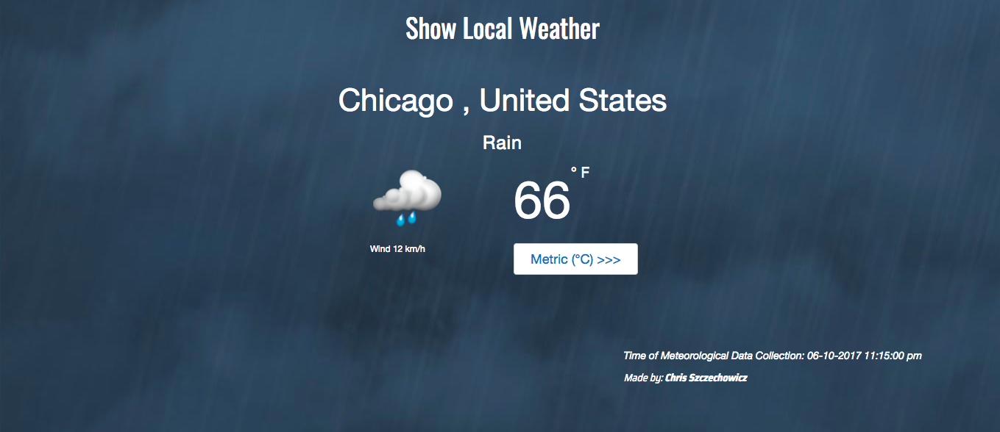

## Show The Local Weather

[See it live](http://christophszcz.github.io/showLocalWeather/)

Up to the minute weather conditions are displayed based off of the user's current location. The [ip-api.com](http://ip-api.com) geolocation API extracts the user's whereabouts, meanwhile the [Open Weather Map](https://openweathermap.org/api) API uses this information to display the corresponding weather data. The [Moment.js library](http://momentjs.com/) is used to pleasantly display the time and date of the data collection. You can also toggle between metric and imperial units.
